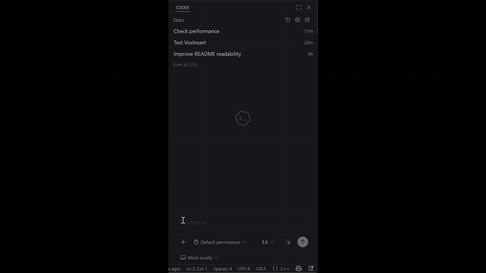

# VoxInsert

VoxInsert is a Windows-native tray app for push-to-talk dictation. Press a global hotkey, speak, press the hotkey again, and VoxInsert transcribes the recording with a configured speech-to-text provider before pasting the text into the currently focused app.

It is built as a local-first utility: API keys stay in Windows Credential Manager, runtime settings live under AppData, temporary audio stays in the temp directory, and optional archiving is disabled by default.

## Demo



## What It Can Do

- Run as a hidden Win32 tray app with a dedicated notification-area icon.
- Start/stop recording with a global hotkey. The default toggle hotkey is `F8`.
- Cancel an active recording with a global hotkey. The default cancel hotkey is `Escape`.
- Record from the current default Windows microphone through PortAudio.
- Save a temporary WAV under `%TEMP%\VoxInsert` for the transcription upload path.
- Transcribe with OpenAI or Mistral through a provider abstraction.
- Paste the transcript into the focused text field through clipboard paste and `Ctrl+V`.
- Optionally send `Enter` after paste through config.
- Show a click-through status pill while recording, transcribing, inserting, and finishing.
- Manage provider API keys from Settings without storing secrets in JSON.
- Show whether an API key exists for the configured credential target.
- Recover the latest in-memory transcript from the tray menu.
- Open the folder for the most recent temporary recording.
- Optionally archive completed dictations as `.opus`, `.txt`, and `.json` files on a background worker.
- Register or unregister per-user Windows startup from Settings.
- Run smoke tests for host lifetime and archive encoding.

## Current Limits

- Windows only.
- Microphone selection uses the OS default input device; there is no device picker yet.
- Text insertion currently uses clipboard paste only.
- Mistral's dedicated offline transcription endpoint currently uses `voxtral-mini-latest`; Voxtral Small would require a separate chat-with-audio implementation path.
- Optional archive files are local filesystem files, not a searchable history UI yet.

## Requirements

- Windows 10 or Windows 11.
- PowerShell.
- Visual Studio Build Tools 2022 with the C++ workload.
- CMake.
- Ninja.
- Git.
- vcpkg, normally at `C:\dev\vcpkg`.
- An OpenAI API key, a Mistral API key, or both.

The bootstrap script can install or validate the native build tools used by this repo.

If PowerShell blocks local scripts in your current shell, run this once before the repo commands below:

```powershell
Set-ExecutionPolicy -Scope Process Bypass
```

## Install From Release Zip

If you just want to use VoxInsert on a Windows machine, download the latest release zip from GitHub Releases.

Extract the zip, then run either:

```powershell
.\install.ps1
```

or double-click:

```text
Install VoxInsert.bat
```

`install.ps1` now asks a few install questions by default: install location, Start Menu shortcut, Desktop shortcut, launch after install, and whether to open Settings after launch.

For automation or testing, skip the prompts with:

```powershell
.\install.ps1 -NonInteractive
```

By default the installer copies VoxInsert into:

```text
%LOCALAPPDATA%\Programs\VoxInsert
```

It creates Start Menu shortcuts, preserves existing AppData config and stored credentials on reinstall, and launches VoxInsert after install. On first install it opens Settings automatically so you can enter your provider key.

To uninstall later, run:

```powershell
& "$env:LOCALAPPDATA\Programs\VoxInsert\uninstall.ps1"
```

The uninstall flow removes the installed program files and shortcuts, then optionally removes config, logs, archive data, and stored provider credentials.

## Install From Source

Clone the repo, then run the bootstrap once:

```powershell
git clone <repo-url> VoxInsert
cd VoxInsert
.\scripts\bootstrap-toolchain.ps1
```

Build the debug executable:

```powershell
.\scripts\build-debug.ps1
```

Build the release executable:

```powershell
.\scripts\build-release.ps1
```

The build uses vcpkg manifest mode. Project dependencies are listed in [vcpkg.json](vcpkg.json): PortAudio, cpr, libopusenc, nlohmann/json, and spdlog.

## Run

Run the debug app:

```powershell
& .\out\build\windows-msvc-debug\VoxInsert.exe
```

Run the release app:

```powershell
& .\out\build\windows-msvc-release\VoxInsert.exe
```

The app starts hidden and adds a tray icon. Right-click the tray icon to open the menu. Choose `Quit` to exit cleanly.

To create a GitHub-distributable release zip locally:

```powershell
.\scripts\package-release.ps1
```

This builds the release executable, stages the required runtime files, runs the smoke tests from the staged package, and writes a zip under `out\release`.

Basic dictation flow:

1. Focus the text box or editor where the transcript should be inserted.
2. Press `F8` to start recording.
3. Speak.
4. Press `F8` again to stop, transcribe, and insert.
5. Press `Escape` while recording to cancel without transcribing.

## First-Time Setup

On first launch, VoxInsert creates `%APPDATA%\VoxInsert\config.json` from [config.example.json](config.example.json) if no user config exists yet.

Open the tray menu and choose `Settings...`.

In the General tab:

- choose the transcription provider
- edit the language hint
- edit toggle/cancel hotkeys
- enable or disable Windows startup
- enable or disable the status pill
- choose status pill placement

In the OpenAI tab:

- set the OpenAI model
- set the Credential Manager target
- enter or remove the OpenAI API key
- edit the OpenAI transcription prompt

In the Mistral tab:

- set the Mistral model
- set the Credential Manager target
- enter or remove the Mistral API key
- edit the Mistral `context_bias` terms

In the Archive tab:

- enable or disable local archiving
- choose whether to save transcript text
- choose whether to save compressed Opus audio
- choose the archive folder

Press `Save` to update `%APPDATA%\VoxInsert\config.json` and apply settings while the app is idle.

## API Keys And Credentials

API keys are stored in Windows Credential Manager through [src/security/api_credential_store.cpp](src/security/api_credential_store.cpp). They are not stored in `config.json`.

Default credential targets:

- OpenAI: `VoiceAgentTyper/OpenAI`
- Mistral: `VoiceAgentTyper/Mistral`

Those credential target names intentionally keep the older `VoiceAgentTyper/...` values so existing Windows Credential Manager entries continue to work after the app rename.

The Settings dialog can save, replace, or remove keys for those targets. It also shows whether a key is currently present without displaying the secret.

On startup, VoxInsert checks whether the selected provider has a stored key and offers to open Settings if it is missing.

## Provider Notes

OpenAI transcription uses the file upload path at `/v1/audio/transcriptions`. The default model is `gpt-4o-transcribe`, with a configurable prompt for coding and technical dictation terms.

Mistral transcription uses `/v1/audio/transcriptions` with `voxtral-mini-latest`. Mistral's `context_bias` field expects comma-separated terms and rejects whitespace inside individual entries, so VoxInsert normalizes entries such as `VS Code` to `VS_Code` before saving or sending.

Provider reference notes live in [documentation/reference/openai-transcription-api.md](documentation/reference/openai-transcription-api.md) and [documentation/reference/mistral-transcription-api.md](documentation/reference/mistral-transcription-api.md).

## Local Data Locations

Runtime config:

```text
%APPDATA%\VoxInsert\config.json
```

Logs:

```text
%LOCALAPPDATA%\VoxInsert\logs\voxinsert.log
```

Temporary recordings:

```text
%TEMP%\VoxInsert\recording-*.wav
```

Optional archive default:

```text
%LOCALAPPDATA%\VoxInsert\Archive\YYYY\MM\DD\clip-*.opus
%LOCALAPPDATA%\VoxInsert\Archive\YYYY\MM\DD\clip-*.txt
%LOCALAPPDATA%\VoxInsert\Archive\YYYY\MM\DD\clip-*.json
```

Archiving is disabled by default. When enabled, archive work is queued to [src/archive/archive_service.cpp](src/archive/archive_service.cpp), which writes files on its own worker thread so compression does not block the Win32 message loop.

## Configuration

The checked-in template is [config.example.json](config.example.json). The live user config is copied to `%APPDATA%\VoxInsert\config.json` on first run.

Important sections:

- `hotkeys`: toggle and cancel hotkey bindings
- `transcription`: provider selection, language hint, provider-specific models, prompts, context bias, and credential targets
- `insertion`: clipboard paste behavior
- `audio`: sample rate, channels, buffer size, and max recording length
- `ui`: status pill visibility and placement
- `system`: Windows startup and minimized launch behavior
- `archive`: optional transcript/audio archive settings

The app can reload config from the tray menu while idle. The Settings dialog is the safer path for common settings because it validates fields and manages credentials.

## Smoke Tests

Run the host smoke test:

```powershell
& .\out\build\windows-msvc-debug\VoxInsert.exe --smoke-test
$LASTEXITCODE
```

Run the archive smoke test:

```powershell
& .\out\build\windows-msvc-debug\VoxInsert.exe --archive-smoke-test
$LASTEXITCODE
```

The host smoke test exercises tray startup/shutdown and recording state transitions without making a real transcription API call. The archive smoke test synthesizes PCM audio, writes an Opus archive clip plus transcript and metadata sidecars, verifies the files, and cleans up after itself.

To inspect recent logs:

```powershell
Get-Content "$env:LOCALAPPDATA\VoxInsert\logs\voxinsert.log" -Tail 40
```

## Microphone Privacy

Classic Win32 desktop apps do not show an in-app microphone consent dialog. If recording fails immediately, check Windows Settings:

```text
Settings > Privacy & security > Microphone
```

Make sure microphone access and desktop app microphone access are both enabled.

## Project Structure

- [src/archive](src/archive): optional transcript and Ogg Opus audio archive service
- [src/audio](src/audio): PortAudio capture and temporary WAV writing
- [src/config](src/config): AppData config loading, validation, defaults, and saving
- [src/input](src/input): global hotkey registration
- [src/insertion](src/insertion): clipboard paste insertion
- [src/observability](src/observability): logging and string conversion helpers
- [src/runtime](src/runtime): hidden Win32 host, tray menu, settings integration, startup registration, and post-recording workflow
- [src/security](src/security): Windows Credential Manager helpers
- [src/testing](src/testing): smoke-test driver
- [src/transcription](src/transcription): provider contract, OpenAI provider, Mistral provider, and provider dispatch facade
- [src/ui](src/ui): native settings dialog and status pill overlay
- [assets](assets): app and tray icon assets
- [scripts](scripts): bootstrap, build, and icon generation scripts
- [documentation/reference](documentation/reference): provider API reference notes

## Development Notes

Useful commands while working:

```powershell
.\scripts\build-debug.ps1
& .\out\build\windows-msvc-debug\VoxInsert.exe --smoke-test
& .\out\build\windows-msvc-debug\VoxInsert.exe --archive-smoke-test
```

If the build fails with `LNK1168: cannot open VoxInsert.exe for writing`, close the running app from the tray or stop it:

```powershell
Get-Process VoxInsert -ErrorAction SilentlyContinue | Stop-Process -Force
```

If you replace [assets/VoxInsertIcon.png](assets/VoxInsertIcon.png), regenerate the Windows icons:

```powershell
pwsh -File .\scripts\generate-app-icon.ps1
```

## Related Docs

- [VoxInsert_Updated_Build_Guide.md](VoxInsert_Updated_Build_Guide.md)
- [documentation/reference/README.md](documentation/reference/README.md)
- [documentation/reference/openai-transcription-api.md](documentation/reference/openai-transcription-api.md)
- [documentation/reference/mistral-transcription-api.md](documentation/reference/mistral-transcription-api.md)
