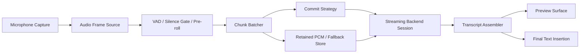

# Streaming Transcription Architecture

## Goal

Design a C++ streaming transcription architecture for VoxInsert that:

- streams microphone audio incrementally instead of waiting for a full WAV file
- supports swappable backends such as a local Whisper-style model, a custom web service, or OpenAI realtime transcription
- normalizes backend-specific partial transcript semantics behind one provider-neutral interface
- avoids sending empty or low-value audio chunks
- handles reconnects, unknown commit state, and fallback cleanly
- is observable, benchmarkable, and testable

This document is intentionally architecture-first. It is a design plan, not implementation code.

## Snapshot

- Date: 2026-05-27.
- Current VoxInsert audio baseline: `16 kHz`, mono, PCM16, `256` frames per read in [src/audio/audio_recorder.cpp](src/audio/audio_recorder.cpp).
- Current VoxInsert transcription baseline: `Stop -> write WAV -> upload -> get final transcript -> insert text` in [src/runtime/post_recording_workflow.cpp](src/runtime/post_recording_workflow.cpp).
- Current transcription abstraction: one final-result request/response interface in [src/transcription/transcription_service.h](src/transcription/transcription_service.h).

## Current VoxInsert Baseline

The current app is optimized for bounded push-to-talk dictation:

1. Start recording.
2. Buffer all audio locally.
3. Stop recording.
4. Write one WAV file.
5. Upload that file.
6. Wait for one final transcript.
7. Paste the final text.

That architecture is clean and reliable, but it is not a streaming architecture.

The current `ITranscriptionService` contract is:

- input: finished file path
- output: one final UTF-8 transcript or an error

That contract is too narrow for streaming because a streaming backend needs to expose:

- incremental audio append
- utterance boundaries or commit events
- partial transcript updates
- final transcript completion
- connection lifecycle and retry state

## What The Current Latency Measurements Already Say

The measurements gathered so far show that the biggest latency cost is the transcription backend, not local file handling.

From the sampled post-recording measurements:

- `stop_recording` is roughly `20-30 ms`
- `wav_write` is roughly `0-2 ms`
- `insert` is roughly `137-151 ms`
- `transcription` is roughly `930-1180 ms`

That means the architecture should optimize the transcription path first.

If the goal is to make the app feel snappier, the core win is reducing or hiding the `~1 second` transcription wait, not micro-optimizing WAV writes.

## External Constraints That Matter

### OpenAI Realtime Transcription

Relevant facts from the OpenAI realtime transcription guidance:

- the low-latency streaming model is `gpt-realtime-whisper`
- realtime transcription sessions use `type: "transcription"`
- `audio.input.format` for `audio/pcm` expects `24 kHz` mono PCM
- audio is streamed with `input_audio_buffer.append`
- transcription begins when the buffer is committed
- transcript deltas arrive as `conversation.item.input_audio_transcription.delta`
- final transcripts arrive as `conversation.item.input_audio_transcription.completed`
- events are keyed by `item_id`
- ordering across different committed items is not guaranteed
- for `gpt-realtime-whisper` transcription sessions, turn detection must be `null`; server VAD is not supported

Design implication:

- VoxInsert must own commit and turn-boundary policy locally if it uses `gpt-realtime-whisper`.

### OpenAI File-Based Streaming

Relevant facts from the Speech-to-Text guidance:

- completed audio uploads can be streamed with `stream=true`
- the stream emits `transcript.text.delta`
- completion emits `transcript.text.done`
- this is for already completed audio, not ongoing microphone streaming

Design implication:

- this is a good compatibility backend and fallback path, but not the main path for true live dictation.

### whisper.cpp Streaming

Relevant facts from `whisper.cpp`:

- the `whisper-stream` example is described as a naive real-time example
- it samples audio continuously and runs transcription in a sliding window
- the example uses periodic decoding rather than a clean append-only delta protocol
- a sliding-window VAD mode exists
- local VAD support exists in the project

Design implication:

- local Whisper-style backends naturally produce revising hypotheses, not just append-only deltas.
- that means the app needs a diff/reconciliation layer, not just a string concatenation callback.

## Core Recommendation

Build the streaming path as three separable layers:

1. Audio capture, chunking, and commit control.
2. Backend session adapters.
3. Transcript assembly and presentation.

The UI and insertion layers should never know whether the backend is:

- OpenAI realtime over WebSocket
- current OpenAI file upload with streamed text events
- a custom self-hosted streaming server
- an in-process local whisper.cpp decoder

They should only receive provider-neutral transcript patches.

## High-Level Architecture



## One Critical UX Rule

Do not stream unstable partial transcripts directly into arbitrary target applications by default.

Why:

- VoxInsert inserts text through clipboard paste today.
- arbitrary Windows text fields do not provide a safe, universal "rewrite the last 12 characters" contract
- many ASR backends revise their tail as more audio arrives

Recommended rule:

- partials go to a preview surface or status overlay
- only finalized text is inserted into the destination field

If live insertion is added later, it should be opt-in and limited to controlled targets or editor integrations that can tolerate tail rewrites.

## Provider-Neutral Interfaces

The architecture should expose one streaming contract that every backend implements.

Suggested shapes:

```cpp
struct AudioChunk {
    std::string utteranceId;
    uint64_t chunkSequence = 0;
    int sampleRate = 16000;
    int channelCount = 1;
    int64_t startOffsetMs = 0;
    bool hasSpeech = false;
    bool isSilencePadding = false;
    float rms = 0.0f;
    std::vector<int16_t> pcm16;
};

enum class BackendTranscriptEventKind {
    AppendDelta,
    Snapshot,
    SegmentFinalized,
    UtteranceFinalized,
    Failed
};

struct BackendTranscriptEvent {
    BackendTranscriptEventKind kind;
    std::string utteranceId;
    std::string backendItemId;
    uint64_t revision = 0;
    std::string text;
    bool isFinal = false;
    std::optional<int64_t> startMs;
    std::optional<int64_t> endMs;
    std::wstring failureReason;
};

enum class TranscriptPatchKind {
    Append,
    ReplaceTail,
    Finalize,
    Reset,
    Error
};

struct TranscriptPatch {
    TranscriptPatchKind kind;
    std::string utteranceId;
    uint64_t revision = 0;
    size_t replaceStartUtf8 = 0;
    size_t replaceEndUtf8 = 0;
    std::string text;
    bool isFinal = false;
    float stability = 0.0f;
};

struct StreamingBackendCapabilities {
    bool appendOnlyDeltas = false;
    bool revisingHypotheses = false;
    bool supportsManualCommit = true;
    bool supportsServerTurnDetection = false;
    bool supportsWordTimestamps = false;
    bool supportsLogProbs = false;
    int requiredSampleRate = 16000;
};

class IStreamingTranscriptionSession {
public:
    virtual ~IStreamingTranscriptionSession() = default;

    virtual bool Start(std::wstring& failureReason) = 0;
    virtual bool AppendChunk(const AudioChunk& chunk, std::wstring& failureReason) = 0;
    virtual bool CommitUtterance(const std::string& utteranceId, std::wstring& failureReason) = 0;
    virtual void CancelUtterance(const std::string& utteranceId) noexcept = 0;
    virtual void Close() noexcept = 0;
};

class IStreamingTranscriptionBackend {
public:
    virtual ~IStreamingTranscriptionBackend() = default;

    virtual std::string_view BackendId() const noexcept = 0;
    virtual StreamingBackendCapabilities Capabilities() const noexcept = 0;
    virtual std::unique_ptr<IStreamingTranscriptionSession> CreateSession(
        std::function<void(const BackendTranscriptEvent&)> onEvent,
        std::shared_ptr<spdlog::logger> logger) const = 0;
};
```

This is the abstraction boundary that keeps the app modular.

## Audio Format And Chunking Strategy

### Internal Canonical Format

Keep VoxInsert's internal capture format as:

- mono
- PCM16
- `16 kHz`

Reasons:

- it already matches the current recorder baseline
- it matches local Whisper-family expectations well
- it minimizes disruption to the current audio code

Provider adapters can resample if they need something else.

For example:

- OpenAI realtime transcription wants `24 kHz` PCM input
- local whisper.cpp typically wants `16 kHz` mono audio and often converts to float internally

Therefore:

- keep the capture side stable
- put resampling inside the backend adapter

### Capture Quantum Versus Network Batch Size

Current recorder reads `256` frames at `16 kHz`, which is about `16 ms` of audio.

That is a good capture quantum, but not necessarily the right network send size.

Recommended split:

- capture quantum: keep `~10-20 ms`
- remote append batch: start with `~50-100 ms`
- local decode cadence: start with `~250-500 ms`

Why split them:

- small capture quanta reduce latency and improve amplitude/VAD responsiveness
- slightly larger network batches reduce overhead and base64/JSON churn
- local sliding-window decoders need a decode cadence that balances CPU cost with transcript freshness

### Pre-Roll And Overlap

Add:

- `200-300 ms` of pre-roll for VAD-based chunk starts
- `200-300 ms` overlap when splitting one long utterance into multiple committed fragments

This prevents clipping the first phoneme of speech and reduces boundary artifacts.

## Empty Audio And Silence Handling

This needs to be explicit, because "empty audio chunk" can mean more than one thing.

### Distinguish These Cases

1. Zero-byte chunk.
   This is a bug or a no-op and must never be sent.

2. Silence chunk.
   This is valid PCM that happens to contain silence or near-silence.

3. Low-value chunk.
   This contains audio but not enough speech to justify remote send or decode.

### Rules

- never call a backend append with an empty `pcm16` vector
- never commit an utterance if the local buffered audio is empty
- never send a remote commit for an utterance that failed minimum speech checks
- suppress silence-only chunks outside pre-roll/post-roll unless a backend explicitly needs continuity audio

For OpenAI realtime specifically:

- the buffer commit errors if the input audio buffer is empty
- VoxInsert should enforce that locally before sending the commit event

### Recommended Local Checks Before Send Or Commit

Track per chunk:

- sample count
- RMS amplitude
- non-zero sample count
- optional VAD probability

Track per utterance:

- total audio ms
- speech ms
- chunk count
- suppressed-silence count

Recommended gating:

- `minChunkMs`: `20-40 ms`
- `minSpeechMsBeforeCommit`: `120-200 ms`
- configurable RMS and/or VAD threshold

### Important Detail

If a backend needs silence continuity, send explicit silence PCM, not an empty vector.

## Commit Strategy Is A First-Class Module

Because OpenAI realtime transcription with `gpt-realtime-whisper` does not support server VAD in transcription sessions, VoxInsert must own commit policy.

That means the app needs a commit-strategy abstraction.

Suggested shape:

```cpp
class ICommitStrategy {
public:
    virtual ~ICommitStrategy() = default;
    virtual std::optional<std::string> OnChunk(const AudioChunk& chunk) = 0;
    virtual std::optional<std::string> OnStop() = 0;
    virtual void Reset() noexcept = 0;
};
```

### Recommended Strategies

#### 1. Commit-On-Stop

This preserves current push-to-talk behavior.

Pros:

- simplest
- lowest architecture risk
- easiest correctness model

Cons:

- no true live partials while the user is still speaking
- only overlaps network upload, not transcript generation itself

#### 2. Periodic Commit

Commit every `N` milliseconds while a push-to-talk hold is still active, with overlap.

Pros:

- earlier partials for long utterances

Cons:

- more boundary stitching problems
- more item ordering complexity
- more transcript revision logic
- can degrade accuracy at chunk edges

This should not be the first implementation.

#### 3. Local-VAD Commit

Continuously record and commit when local VAD decides a speech turn ended.

Pros:

- fits open-mic workflows
- required if the backend lacks server turn detection

Cons:

- VAD tuning becomes a core product problem
- false boundaries are user-visible

## Backend Adapter Designs

### OpenAIRealtimeTranscriptionBackend

This backend should:

- own a WebSocket transcription session
- resample VoxInsert's `16 kHz` PCM16 to `24 kHz` PCM16 for append events
- base64 encode audio chunks for `input_audio_buffer.append`
- send `input_audio_buffer.commit` when the commit strategy says an utterance should finalize
- map `conversation.item.input_audio_transcription.delta` to append-only backend events
- map `conversation.item.input_audio_transcription.completed` to final backend events
- keep a local map from `utteranceId -> item_id`

Important design note:

- because completion ordering across different items is not guaranteed, the assembler must group by `item_id` or local `utteranceId`, not by arrival time alone

Important limitation:

- `gpt-realtime-whisper` transcription sessions require local turn control because server VAD is not available

### OpenAIFileStreamingBackend

This backend should be treated as:

- a compatibility backend
- a correctness fallback
- a benchmarking baseline

It can reuse the existing finished-audio flow while translating streamed text events into the same transcript event model.

This backend is valuable because:

- it is much simpler to retry deterministically
- it can recover utterances when a realtime session dies mid-turn
- it gives VoxInsert one stable fallback path while streaming is being developed

### LocalWhisperBackend

This backend should preferably be in-process rather than shelling out to a CLI.

It should:

- own a decoder instance and model lifetime
- maintain a sliding context window
- decode on a periodic cadence such as `250-500 ms`
- emit revising hypothesis snapshots rather than pretending its output is append-only
- optionally use local VAD before decode or before finalization

Design implication:

- this backend is the best fit if the product goal is "show partial text while speaking"
- it is also the backend most likely to need a strong diff/reconciliation layer

### CustomServerBackend

If VoxInsert later uses a self-hosted streaming server, this backend should still implement the same `IStreamingTranscriptionSession` contract.

The server contract should ideally support:

- client-supplied `utteranceId`
- client-supplied `chunkSequence`
- explicit `append`, `commit`, `cancel`
- idempotent replay after reconnect
- final transcript events and optional partial events

That will be easier to recover cleanly than a black-box third-party streaming service.

## Transcript Assembly And Diff Generation

This is the heart of the architecture.

The backend interface must not leak raw provider semantics upward.

### There Are Two Different Delta Models

#### Append-Only Delta Model

Examples:

- OpenAI realtime transcription delta events
- OpenAI file-based streamed transcript events

These produce new text fragments that should be appended exactly as received.

Critical detail:

- do not insert unconditional spaces between deltas
- backend deltas may already include correct leading or trailing spaces and punctuation

#### Revising Hypothesis Model

Examples:

- local Whisper sliding-window decoding
- backends that repeatedly emit the best current guess for the same utterance

These may rewrite the tail as more audio arrives.

### Recommended Internal Normalization

Normalize backend output into these event types:

- `AppendDelta`
- `Snapshot`
- `SegmentFinalized`
- `UtteranceFinalized`
- `Failed`

Then run those through a `TranscriptAssembler` that produces provider-neutral `TranscriptPatch` objects.

### OpenAI Handling

For OpenAI append-only deltas:

- accumulate raw delta text for the corresponding `item_id`
- emit `Append` transcript patches as deltas arrive
- emit `Finalize` when the completed event arrives

No complex diff is needed here.

### Whisper Handling

For local Whisper-style revising snapshots:

- never append raw snapshot text directly to the final transcript buffer
- keep both a committed prefix and an unstable suffix
- compare each new hypothesis against the previous hypothesis
- only promote text to committed once it crosses a stability rule

### Stability Rules For Revising Backends

Use one or both of these:

1. Confirmation count.
   A token or segment must appear unchanged in `N` consecutive snapshots.

2. Rollback horizon.
   Anything older than a configured time horizon such as `700-1000 ms` is treated as stable unless the backend explicitly revises timestamps.

Recommended starting rule:

- commit the longest common prefix that is unchanged for `2-3` snapshots or falls outside an `800 ms` rollback horizon

### Suggested Tail-Rewrite Algorithm

1. Normalize previous and new hypothesis into tokens or timestamped segments.
2. Prefer timestamp alignment when the backend provides timestamps.
3. Otherwise compute a longest common prefix on normalized token text.
4. Promote the stable prefix into committed text.
5. Emit one `ReplaceTail` patch for the remaining unstable suffix.
6. On utterance finalization, finalize the remaining suffix.

Pseudo-shape:

```text
previous committed prefix + previous unstable tail
new hypothesis -> align -> stable prefix -> unstable suffix
emit ReplaceTail from old unstable tail to new unstable suffix
```

This is the key piece that allows one UI to consume both OpenAI-style deltas and Whisper-style revising hypotheses.

## Retry, Reconnect, And "Lost Packets"

The phrase "lost packets" needs to be handled carefully.

If the transport is WebSocket over TCP, VoxInsert does not need to design for raw UDP-style packet repair.

What it does need to design for is:

- disconnects
- stalls
- write failures
- unknown commit state
- duplicate replay after reconnect

### Required Local State

Per active utterance, keep:

- `utteranceId`
- retained PCM buffer
- `lastSentChunkSequence`
- `commitRequested`
- `commitAcknowledged`
- `finalTranscriptReceived`
- backend `item_id` when known

### Recovery Rules

#### Socket drops before commit acknowledgement

State is unknown.

Recovery:

- create a new session
- replay retained PCM for the active utterance
- or fallback immediately to the finished-file backend

#### Socket drops after partials but before final transcript

Recovery:

- keep the preview text visible but mark it provisional
- resubmit the retained PCM through a fallback backend to recover one final transcript

#### Socket drops after final transcript received

No retry is needed for that utterance.

### Retry Policy

For live streaming:

- reconnect quickly with bounded backoff and jitter
- do not keep retrying forever during a live user interaction
- cap live reconnect attempts to a small number such as `2-3`

For bounded fallback file transcription:

- use the existing more conservative retry approach because correctness matters more than live feel at that point

### Idempotency Advice

For custom server backends, require idempotent `utteranceId` handling.

For third-party backends that do not expose true idempotency on commit, treat the local retained PCM buffer as the source of truth and rebuild the final result from fallback if session state becomes ambiguous.

## Observability

Streaming systems become hard to debug unless every utterance and every session is observable.

### Add Correlation IDs

At minimum:

- `session_id`
- `utterance_id`
- `chunk_sequence`
- backend `item_id` when available

### Metrics That Matter

Per utterance:

- `capture_to_first_append_ms`
- `time_to_first_delta_ms`
- `time_to_first_stable_ms`
- `time_to_final_ms`
- `revision_count`
- `chars_replaced`
- `fallback_used`
- `reconnect_count`

Per chunk:

- `chunk_duration_ms`
- `chunk_samples`
- `chunk_rms`
- `speech_probability`
- `chunk_suppressed_empty`
- `chunk_suppressed_silence`

Per backend session:

- `session_start`
- `session_end`
- `bytes_sent`
- `append_errors`
- `commit_errors`
- `completed_events`
- `transport_errors`

Local processing metrics:

- `resample_ms`
- `base64_encode_ms`
- `local_decode_ms`
- `assembler_ms`
- `insert_ms`

### Logging Guidance

- keep per-chunk logs at `debug`
- keep utterance summaries at `info`
- keep backend errors at `warn` or `error`
- keep release defaults conservative but allow runtime override

### What To Watch In Production

- empty commits attempted
- non-empty utterances that produced empty final text
- reconnects during active speech
- repeated tail rewrites that never stabilize
- local queue growth and backpressure

## Testability

The architecture should be testable without a live microphone and without a live network connection.

### Recommended Test Doubles

- `FakeAudioSource`
- `FakeClock`
- `FakeStreamingSession`
- `FakeTranscriptSink`

### Unit Tests

Write unit tests for:

- empty chunk suppression
- silence gating
- commit strategy timing and boundaries
- OpenAI append-only delta assembly
- Whisper revising-tail assembly
- reconnect state transitions
- fallback-to-file behavior

### Golden Trace Tests

Record backend event traces and replay them deterministically.

Useful trace types:

- append-only OpenAI deltas followed by completion
- Whisper snapshots that revise the last word repeatedly
- out-of-order completion events across multiple backend items
- mid-utterance connection drop

Golden trace tests are the best way to test diff logic without depending on a live model.

### Integration Tests

Add integration tests that:

- feed canned PCM fixtures into the pipeline
- assert the sequence of transcript patches
- assert the final inserted transcript
- simulate a reconnect and verify fallback recovery

### Performance Tests

Benchmark:

- first delta latency
- final transcript latency
- revision count per utterance
- CPU cost of local decode cadence
- memory growth of retained PCM buffers

## Recommended Rollout For VoxInsert

### Phase 1: Carve The Interfaces Without Changing UX

- keep the current finished-file backend
- add retained PCM buffering and transcript event plumbing
- keep final clipboard paste behavior unchanged

This phase should not try to show live text yet.

### Phase 2: Add A Preview Surface

- show partial text in an overlay, debug surface, or status view
- do not insert partials into arbitrary apps yet
- add first-delta and final-latency metrics

This makes streaming useful before final insertion semantics get complicated.

### Phase 3: Add OpenAI Realtime Backend

Start with the lowest-risk version:

- long-lived or short-lived transcription session
- local append batching
- manual commit strategy
- final insertion still happens only on finalized text

This is the fastest path to a real backend implementation, but it is not the final answer for every UX goal.

### Phase 4: Add Local Whisper Backend

- integrate whisper.cpp in-process
- add a sliding-window decoder
- implement revising-tail assembly
- warm the model eagerly or on first-use background initialization

This is the path most likely to improve perceived responsiveness while speaking.

### Phase 5: Add A Custom Server Backend Only If Needed

Do this only if you need:

- centralized model hosting
- stronger server-side state and replay control
- team-shared infrastructure or model selection logic

Do not start here unless there is already a clear operational need.

## Hard Truths And Tradeoffs

### Streaming Audio Does Not Automatically Mean Live Text

If the backend only starts transcription on commit, then streaming audio while speaking mainly hides upload time, not the entire model processing delay.

That means:

- remote append + commit-on-stop is still useful
- but it will not feel as live as a backend that produces partials before stop

### OpenAI Realtime Is Not A Perfect Drop-In For Open-Mic VAD

For `gpt-realtime-whisper` transcription sessions, VoxInsert owns the turn boundaries.

That is a workable architecture, but it means:

- you need local commit logic
- you need local silence policy
- you need to handle ambiguous mid-turn reconnects yourself

### Local Models Give Better Control But Bigger Operational Cost

Benefits:

- no network round-trip
- full control over chunking and decode cadence
- easier to produce partials while speaking

Costs:

- model download and warm-up
- much larger memory footprint
- CPU and GPU load become a product constraint
- Windows packaging gets heavier

### The Biggest Product Win Is Usually Preview, Not Live Insertion

If the user can see partial text while speaking and gets a final insert quickly at the end, the app already feels much snappier.

Trying to rewrite arbitrary app text fields in real time is a second, riskier problem.

## Recommendation For VoxInsert Specifically

If the goal is the best effort-to-value ratio:

1. Keep final insertion behavior as final-only.
2. Add a provider-neutral streaming pipeline and transcript patch model.
3. Add a preview surface for partials.
4. Implement one realtime backend and one fallback backend.
5. Add local Whisper later if offline or lower-latency partials become worth the packaging and runtime cost.

If the goal is the lowest implementation risk:

- start with a streaming-compatible architecture but keep the current file backend alive as fallback

If the goal is the snappiest perceived UX:

- a local streaming backend or a custom backend with revising partials is the stronger fit than a pure finished-file upload path

## Sources Consulted

Current repo anchors:

- [src/audio/audio_recorder.cpp](src/audio/audio_recorder.cpp)
- [src/runtime/post_recording_workflow.cpp](src/runtime/post_recording_workflow.cpp)
- [src/transcription/transcription_service.h](src/transcription/transcription_service.h)
- [src/transcription/openai_transcription_service.cpp](src/transcription/openai_transcription_service.cpp)
- [src/transcription/mistral_transcription_service.cpp](src/transcription/mistral_transcription_service.cpp)
- [config.example.json](config.example.json)

External references:

- OpenAI Speech to Text: https://developers.openai.com/api/docs/guides/speech-to-text
- OpenAI Realtime Transcription: https://developers.openai.com/api/docs/guides/realtime-transcription
- OpenAI Realtime Reference: https://developers.openai.com/api/reference/resources/realtime
- OpenAI Realtime And Audio Overview: https://developers.openai.com/api/docs/guides/realtime
- whisper.cpp main README: https://github.com/ggml-org/whisper.cpp
- whisper.cpp stream example: https://github.com/ggml-org/whisper.cpp/tree/master/examples/stream